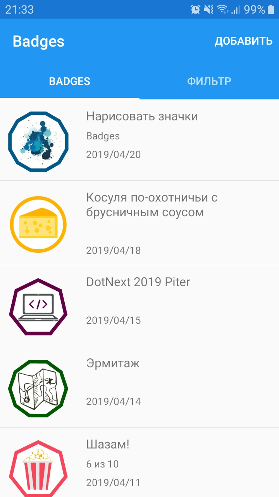
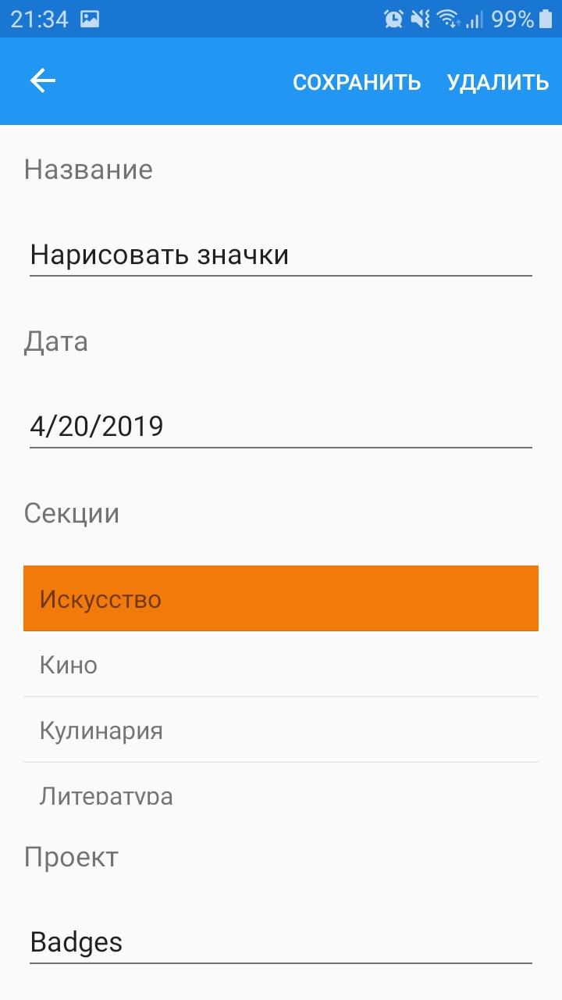

# Badges

Журнал для Android, который позволяет сохранять, редактировать и просматривать значки, связанные с определённой категорией. Приложение может быть использовано для:
- отметки событий;
- ведения небольших заметок;
- контроля активности;
- мониторинга вредных привычек и так далее;

Данные хранятся в SQLite базе данных, доступной в памяти устройства в папке _Badges_. Таким образом, пользователь всегда имеет доступ к изменению и резервному копированию данных.

<table>
   <tr>
      <td></td>
      <td></td>
   </tr>
</table>

## Использованные технологии

- Xamarin Forms
- Android SDK
- SQLite